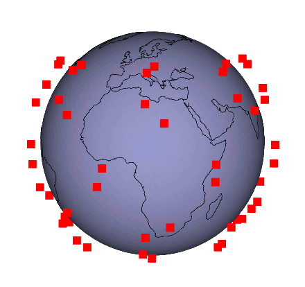

<center>  </center>


README
===

**Abstract**

*Large, low Earth orbit, broadband satellite networks, have recently become a growing area of research as a number of implementations are currently being constructed by commercial businesses. Unlike current systems, these new constellations are comprised of 100's to 1,000's of interconnected satellites. This Thesis seeks to create and demonstrate a tool for generating and simulating such networks.*

Getting started:
* All of my development and testing has been done with linux mint 19.3, with kernel version 5.3
* [Install Guide](installguide.md)
* [User Guide](userguide.md)

## Use

If you end up using the tool for something, please cite the related thesis document via one of the methods below. The code is licensed under the GNU General Public License Version 3.

BibTeX Citation:
```
@thesis{bskempton,
    author={Kempton,Benjamin S.},
    year={2020},
    title={A Simulation Tool to Study Routing in Large Broadband Satellite Networks},
    journal={ProQuest Dissertations and Theses},
    isbn={9798662568945},
    url={https://search.proquest.com/docview/2438605919?accountid=27868},
}
```

IEEE:
```
[1] B. S. Kempton, "A Simulation Tool to Study Routing in Large Broadband Satellite Networks." Christopher Newport University, 2020.
```