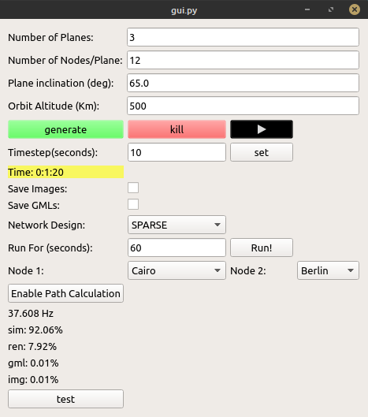
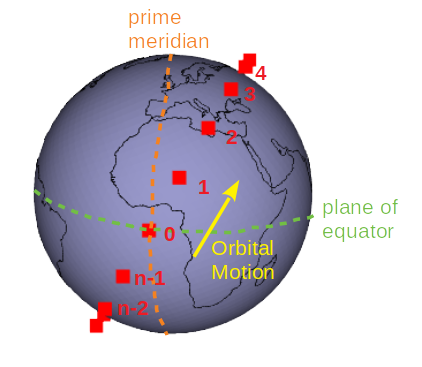
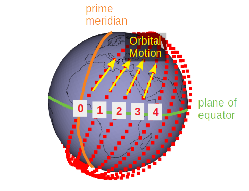
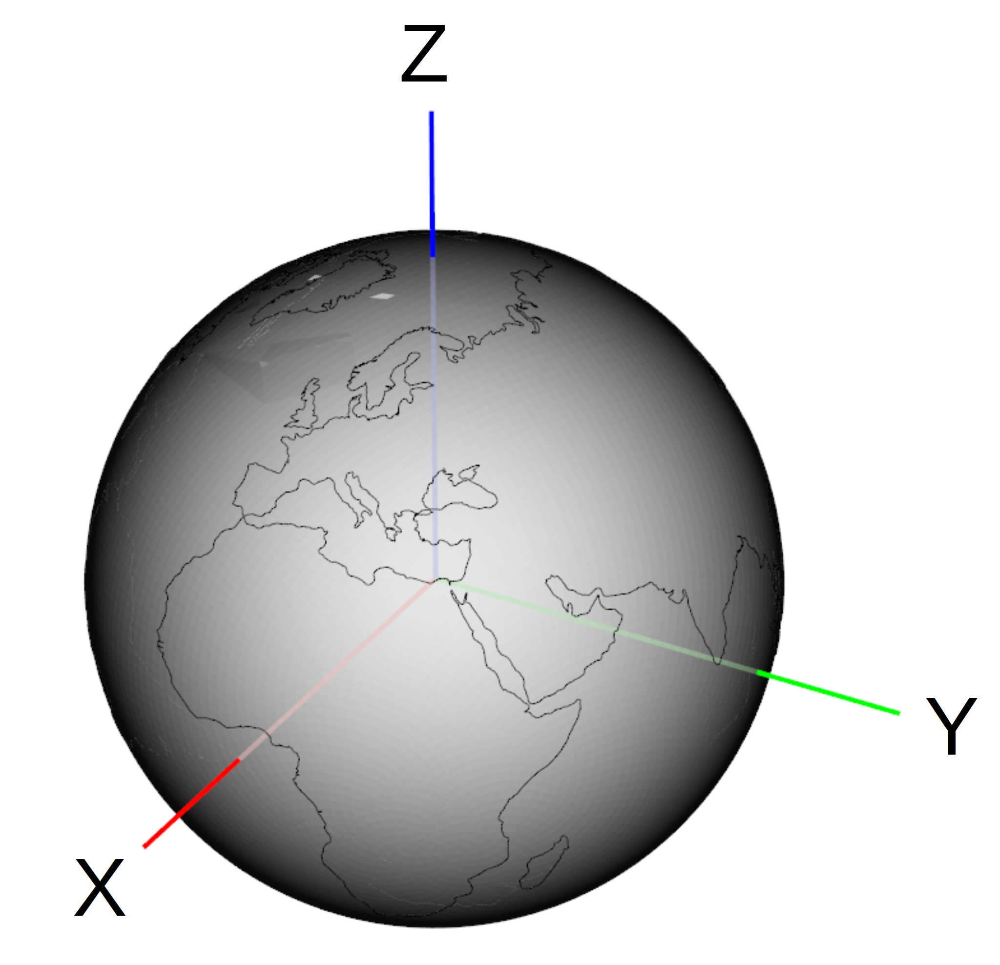

# User Guide

## Getting started:

If you plan on using the control GUI, navigate to the top level of the repository
```bash
# run the gui script with python
~path_to_repo$ python3 ./gui.py
```

This should result in the following GUI appearing:

<center>
<figure>
  
</figure>
</center>

Adjust the Number of Planes, Nodes Per Plane, Inclination and Orbit Altitude to your liking.
Then press "generate" to start the model. A 512x512 pix render window of the model should appear looking down on the North Pole. The model is interactive, just click on it and drag, zoom, pan, etc. with your mouse. Most of the buttons and fields have helpful tooltips if you hover the mouse over them.

Because the model is running on a separate process from the GUI, use the "Kill" button to end the simulation model!

___
## Data Structures

The data representing the satellite constellation, ground points, and links are all stored as separate numpy arrays. This is done to improve the memory efficiency of the simulation, and make it easier to add acceleration with PyCUDA and Numba.

### Constellation & Groundstations

A satellite is described by two integer values:
* Plane (what orbital plane the satellite belongs to)
* Offset (the number of the satellite within the plane)

Numbering is as follows:

<center>
<figure>
  
  <figcaption>At simulation time t=0, the first satellite in a plane starting from the ascending node <a href="https://en.wikipedia.org/wiki/Orbital_elements">(orbital terms 101)</a>  has the offset number "0".  Satellites are numbered sequentially in the direction of orbital motion, all the way up to [number-of-satellites-in-plane]-1 </figcaption>
</figure>

<figure>
  
  <figcaption>At simulation time t=0, the plane the first ascending node starting from the reference direction (ray defined by the positive x direction in this simulation) and moving along the reference (XY) plane Eastward will be plane "0". Plane numbers increment moving eastward.  </figcaption>
</figure>

</center>


In this work, a satellite may be referred to by "plane-number","offset-number". For example; satellite offset 4 in plane number 2 would be called "2,4"

This format is great for readability, but not so great for dealing with links. It is much better to have a single **unique** value to name each satellite with. In order to give all the satellites (and ground stations) in the simulation a unique integer name, the following scheme is used:
```python
# satellites are positive integers
Satellite_ID = (plane_number * number_of_satellites_per_plane) + offset_number
# if multiple constellation simulations are implemented:
Satellite_ID = (constellation_number * satellites_in_previous_constellation) + (plane_number * number_of_satellites_per_plane) + offset_number

# ground stations are negative integers
# counter is decremented after creation of a new ground point
GS_ID_Counter = -1
GroundStation_ID = GS_ID_Counter
GS_ID_Counter = GS_ID_Counter-1
```

In addition to a plane and offset numbers, satellites have a position described by cartesian coordinates (x,y,z). These will be 32-bit signed integers representing meters. This means that the farthest point possible in the simulation is (2^31)-1 meters (2,147,483 km) from the origin. This is ~5.5 times the distance from Earth to the moon, and therefore acceptable for simulating earth orbiting satellites. Also, 1 meter resolution should be good enough for a networking simulation.

Therefore, the numpy array containing the satellite constellation will have the following structure:

```python
# Satellites array
  # Satellites array
  SATELLITE_DTYPE = np.dtype([
    ('ID', np.int16),               # ID number, unique
    ('plane_number', np.int16),     # which orbital plane the satellite is in
    ('offset_number', np.int16),    # satellite number local to a plane
    ('time_offset', np.float32),    # time offset for Kepler Ellipse solver
    ('x', np.int32),                # x position in meters
    ('y', np.int32),                # y position in meters
    ('z', np.int32)])               # z position in meters

# Groundstations array
GROUNDPOINT_DTYPE = np.dtype([
	('ID', np.int16),      # ID number, unique, = array index
	('init_x', np.int32),  # initial x position in meters
	('init_y', np.int32),  # initial y position in meters
	('init_z', np.int32),  # initial z position in meters
	('x', np.int32),       # x position in meters
	('y', np.int32),       # y position in meters
	('z', np.int32)])      # z position in meters
```

### Links

The data structure for links is very simple, endpoints are integers (satellite_ID or Groundstation_ID), where if the link is between a groundstation and a satellite, the groundstation will be node_1:

```python
# link array
LINK_DTYPE = np.dtype([
	('node_1', np.int16),     # an endpoint of the link
	('node_2', np.int16),     # the other endpoint of the link
	('distance', np.int32)])  # distance of the link in meters
```
In future work other values may be added, like data rate or power cost.


## Coordinate System

3D cartesian, origin is the geometric center of the Earth. Upon simulation init, Earth is alligned as follows:
<center>
<figure>
  
  <figcaption>At simulation time t=0, Earth is alligned like this, with 0 longitude alligning with the positive X axis. As the earth rotates, this alignment repeats once per 24 hours. Satellites orbit around the origin. </figcaption>
</figure>
</center>

## Rendering with VTK (OpenGL)

Like me, you might wonder what the numerous vkt calls are for.
Answer: you need to manually configure a render pipeline for
each object (vtk actor) in the scene.
A typical VTK render pipeline:

1. point data array   <-- set/update position data

2. poly data array
	
3. poly data mapper
	
4. object actor   <-- edit color/size/opacity, apply rotations/translations
	
5. vtk renderer
	
6. vkt render window
7. vkt render interactor   <-- trigger events, animate
	
The render window is what pops up on your screen to display the various objects or actors in the scene.

## Using GML Files

TODO


